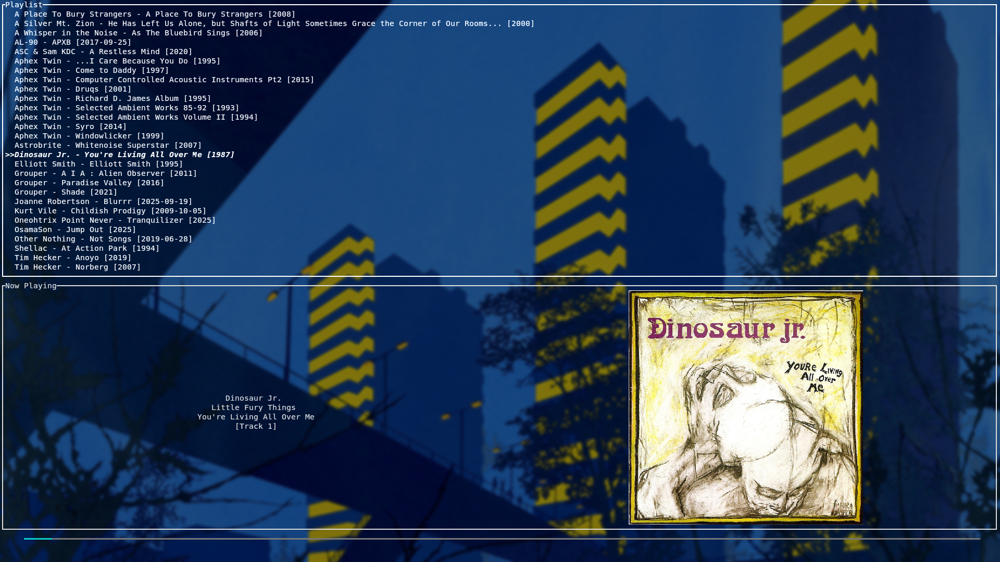
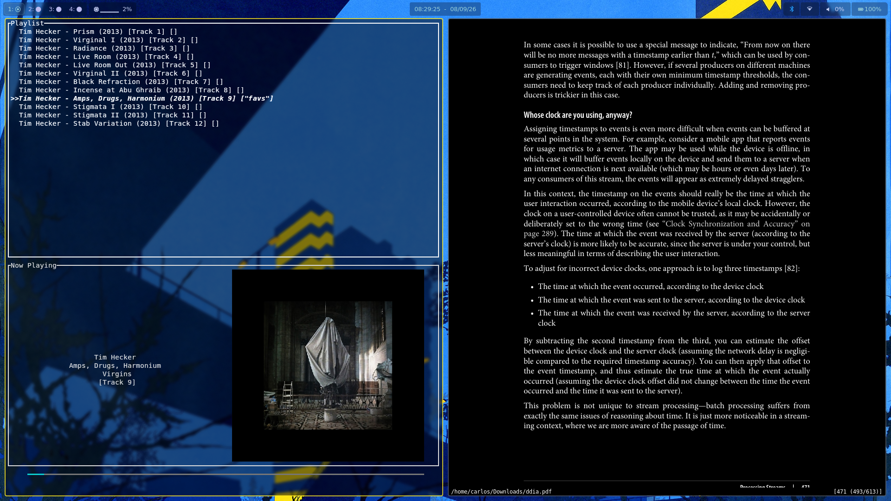
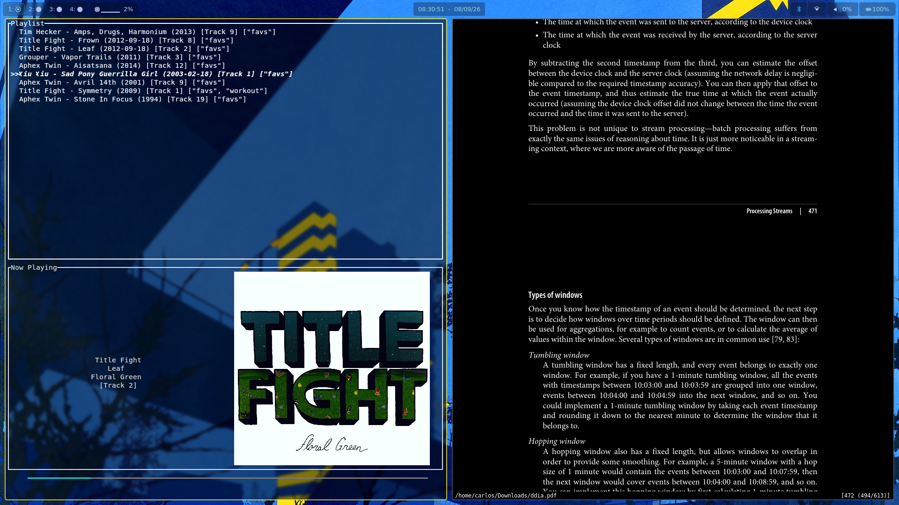

# bragi-rs

- Terminal-based, music browser and player.
- Vim motions.

### Keybinds

- `j`: move down
- `k`: move up
- `h`: previous song
- `l`: next song
- `/`: enter search mode
- `SPACE`: pause / play the song
- `m`: Tag a song with a label.
- `Esc`:
  - if in any mode other than normal, return back to normal mode.
  - if already in normal mode, return to album selection.
- `Enter`:
  - if searching: submit search query, and filter songs.
  - if in normal mode: open an album, or play a song.

### Disclaimers
- Very early in development.

### Screenshots

